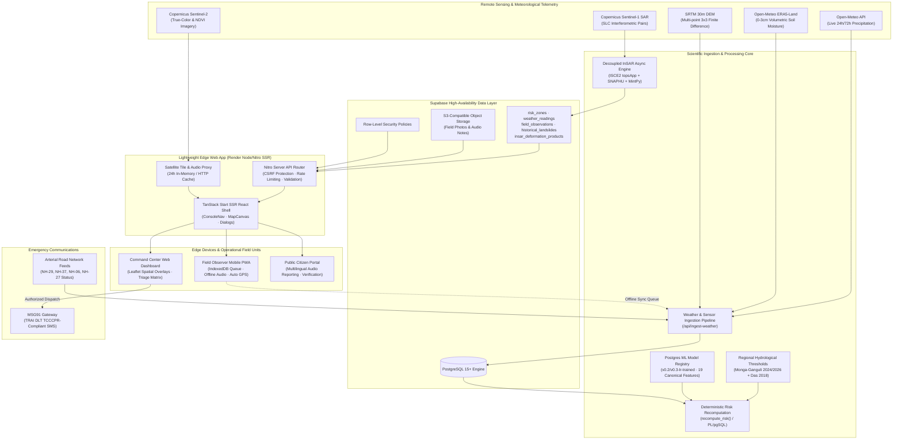

# LandAlert-Nexus: Sentinel of the North Eastern Region

**SIH26001 — AI-Augmented Multi-Hazard Landslide Early Warning, Geodetic Monitoring & Emergency Response System**

[](https://landalert-nexus.onrender.com)
[](src/lib/)
[](tsconfig.json)
[](src/routes/)
[](public/sw.js)
[](src/locales/)

---

## 1. Executive Summary & Operational Mandate

The Northeastern Region (NER) of India—spanning **Arunachal Pradesh, Assam, Manipur, Meghalaya, Mizoram, Nagaland, Sikkim, and Tripura**—presents one of the world's most acute slope-failure hazard profiles due to intense monsoon precipitation, active tectonic convergence, and fragile sedimentary lithologies.

While national initiatives like GSI's LANDSLIP provide vital baseline capabilities, NER hill tracts frequently face localized monitoring blindspots, sparse terrestrial rain gauges, steep telecommunication outages, and linguistic barriers during catastrophic slope failures.

**LandAlert-Nexus** closes these gaps by deploying a production-ready, multi-layered early warning and incident management platform that synthesizes:
1. **Hydrological & Soil Saturation Threshold Physics** calibrated specifically to Northeastern Himalayan catchments.
2. **Machine Learning Risk Classification** operating under a strict zero-leakage, reproducible model registry.
3. **Satellite Radar Interferometry (InSAR) & Optical Earth Observation** for pre-failure slope creep and canopy defoliation detection.
4. **Resilient Offline-First Progressive Web Architecture (PWA)** with automatic background GPS acquisition, offline IndexedDB sync, and voice notes.
5. **Multilingual Inclusivity Across 9 Languages** ensuring critical warnings and citizen reports transcend regional linguistic divides.
6. **TRAI-Compliant Multi-Channel Emergency Dispatch & Triage** empowering district incident commanders to allocate life-saving rescue logistics.

---

## 2. System Architecture & End-to-End Workflow



---

## 3. Technology Stack

| Layer | Primary Technology | Purpose & Architectural Role |
| :--- | :--- | :--- |
| **Frontend Framework** | React 19, TanStack Start, TanStack Router | Modern SSR application architecture with type-safe routing, hydration caching, and SEO optimization. |
| **State & Data Fetching** | TanStack Query (React Query v5) | Asynchronous query caching, optimistic UI mutations, and server-action synchronization. |
| **Geospatial Mapping** | Leaflet, React-Leaflet, CartoDB Tiles | Interactive high-performance GIS dashboard featuring multi-layered risk centroids, hazard circles, and satellite overlays. |
| **Design & Accessibility** | Tailwind CSS v4, Radix UI Primitives, Lucide Icons | Responsive glassmorphism interface, dark/light theme persistence, screen-reader landmarks, and Atkinson Hyperlegible typography. |
| **Backend & Ingestion** | Nitro (H3), TanStack Start Server Functions | Embedded edge server running API routes, CSRF token validation, input sanitization, and rate limiting. |
| **Database & Auth** | Supabase (PostgreSQL 15+), PostgREST, GoTrue Auth | Relational datastore with Row-Level Security (RLS), ACID transactions, and role-based access control (Citizen vs. Official). |
| **Offline Architecture** | ServiceWorker, Cache API, IndexedDB | Comprehensive offline shell caching, idempotent mutation queues, and automatic background retry engine. |
| **ML & Analytics** | Scikit-Learn, NumPy, Pandas, PL/pgSQL | 19-feature logistic regression hazard scoring, spatial proximity matrices, and calibrated probability estimators. |
| **InSAR & Earth Observation** | ISCE2 (`topsApp.py`), SNAPHU, MintPy, GDAL | Dedicated geodetic processing architecture generating millimeter-scale ground displacement grids. |
| **Telecommunications** | MSG91 Flow API, TRAI DLT Engine | Telecom Regulatory Authority of India (TCCCPR 2018) compliant emergency SMS broadcast delivery. |
| **Build & Test Suite** | Vite 8, TypeScript 5.9, Vitest | Fast bundling, strict static type safety, and 322 automated unit, integration, and security tests. |

---

## 4. Key Subsystems & Core Capabilities

### 4.1 Physics-Grounded Risk Engine & ML Model Registry
Unlike black-box models, LandAlert-Nexus combines published empirical hydrology equations with a governed linear model to generate **actionable, explainable alerts**:
- **Regional Precipitation Physics**: Integrates the **Monga & Ganguli (2024; 2026)** Northeastern Himalayan moisture threshold $E(\text{mm}) = -11.10 + 0.62 \times D(\text{hr})$ across all non-Sikkim zones, and the **Das et al. (2018)** Intensity-Duration equation $I = 43.26 \times D^{-0.78}$ for Sikkim catchments.
- **Dynamic Feature Attribution**: Explanations rank the dominant drivers (e.g., 72h rainfall surge vs. 30-day antecedent saturation vs. slope gradient) so district officials understand *why* a risk level shifted.
- **Production ML Governance**:
  - `risk_model_config` stores immutable model versions, weights, decision thresholds, and PR-AUC scores.
  - Active model `v0.2-lr-trained` utilizes 19 canonical features (antecedent rainfall windows, slope sine/norm, soil moisture trends, historical event proximity).
  - PostgreSQL unique constraint `uq_single_active_model` guarantees zero dual-model execution collisions.

### 4.2 Satellite InSAR Geodetic Pipeline & Optical Remote Sensing
- **Sentinel-1 SAR Interferometry**: Observes slope creep and deep-seated ground displacement across an extensive 0.25-degree grid covering all 8 NER states.
- **Scientific Zero-Fabrication Guarantee**: The system never generates synthetic deformation numbers and forbids zero-fill defaults (`0.0 mm/yr`). Unprocessable or decorrelated zones explicitly report `UNAVAILABLE` with technical causes (`SAR_DECORRELATION_DENSE_CANOPY`, `LOW_COHERENCE`, `INSUFFICIENT_ACQUISITIONS`).
- **Asynchronous Worker Decoupling**: Compute-intensive SAR processing is isolated from the main web server into a stateless background worker lifecycle (`QUEUED` $\to$ `PROCESSING` $\to$ `COMPLETED`).
- **Sentinel-2 Multispectral Overlays**: Provides high-resolution True-Color imagery and NDVI vegetation health layers with 24-hour server-side caching to respect operational quotas.

### 4.3 Resilient Offline-First Field Operations & Voice Intelligence
In rural hill areas, cellular towers frequently fail during cloudbursts and landslides. LandAlert-Nexus ensures zero data loss:
- **Automatic GPS Acquisition on Login**: Device coordinates are captured in the background as soon as an observer signs in or opens the app. Coordinates are persisted across session storage and IndexedDB.
- **Zero-Click Coordinate Population**: When submitting a field observation, latitude, longitude, and accuracy are automatically bound to the report, auto-detecting the active administrative state, district, and monitoring zone without requiring manual GPS clicks.
- **Offline Audio Notes**: High-fidelity compressed audio recordings are stored in IndexedDB when network connectivity is lost. As soon as the device reconnects, the background queue synchronizes media files and observation telemetry to Supabase.
- **Dual Voice-to-Text Architecture**: Integrates real-time Web Speech recognition with graceful in-browser offline translation fallback.

### 4.4 9-Language Multilingual Localization
To serve field workers and local residents across the entire North Eastern Region, all navigation, alert bulletins, observation forms, and accessibility dialogs are fully localized in:
1. **English** (`en`) — Operational Administrative Baseline
2. **Hindi** (`hi`) — हिन्दी
3. **Assamese** (`as`) — অসমীয়া
4. **Bengali** (`bn`) — বাংলা
5. **Manipuri** (`mni`) — মৈতৈলোন্ (Meitei Mayek)
6. **Mizo** (`lus`) — Mizo ṭawng
7. **Khasi** (`kha`) — Ka Ktien Khasi
8. **Garo** (`grt`) — A·chik Ku·sik
9. **Nepali** (`ne`) — नेपाली

### 4.5 Emergency Response Prioritization & Triage
Incident commanders must triage limited rescue personnel across widespread simultaneous slope failures:
- **Algorithmic Priority Formulation**:
  $$S_{\text{priority}} = 0.40 \times C_{\text{severity}} + 0.25 \times C_{\text{population}} + 0.20 \times C_{\text{road}} + 0.15 \times C_{\text{observation}}$$
- **Handling Degraded Telemetry**: Zones with missing sensors or lost communications are placed into an explicit unranked investigation tier rather than artificially downgraded to low risk.
- **TRAI DLT-Compliant Emergency SMS**: Dispatches pre-registered multilingual alert templates via MSG91, complete with bypass mechanisms for emergency notifications.

---

## 5. Monitored Geographic Risk Zones (All 8 NER States)

| Zone ID | Monitored Sector | State | Centroid (Lat, Lng) | Primary Strategic Infrastructure |
| :---: | :--- | :--- | :---: | :--- |
| **1** | Tamenglong Hill Slopes | Manipur | 24.97°N, 93.51°E | NH-37 arterial corridor & Western Manipur tribal habitations |
| **2** | Noney Corridor | Manipur | 24.82°N, 93.68°E | Jiribam-Imphal railway bridge project & Tupul valley sector |
| **3** | Aizawl East Urban Slopes | Mizoram | 23.74°N, 92.74°E | Densely populated urban escarpments & Tuirial watershed |
| **4** | Lunglei Hill Slopes | Mizoram | 22.88°N, 92.51°E | Southern Mizoram road link & Tlabung/Marpara valley flank |
| **5** | Shillong-Sohra Escarpment | Meghalaya | 25.30°N, 91.72°E | High-rainfall tabular plateau plunging toward Bangladesh border |
| **6** | Jaintia Hills Ridge | Meghalaya | 25.18°N, 92.36°E | NH-06 arterial highway connecting Barak Valley, Tripura & Mizoram |
| **7** | Kohima Ridge Corridor | Nagaland | 25.66°N, 94.12°E | Urban spine of Kohima municipal area & Patkai range pass |
| **8** | Dimapur Foothills | Nagaland | 25.90°N, 93.73°E | Pagla Pahar / Chumukedima flank on NH-29 gateway highway |
| **9** | Papum Pare Capital Region | Arunachal Pradesh | 27.10°N, 93.69°E | Itanagar-Naharlagun capital complex & Takar colony slopes |
| **10** | Dibang Valley | Arunachal Pradesh | 28.28°N, 95.84°E | High-altitude strategic border corridor & NH-313 Hunli-Anini highway |
| **11** | Gangtok-Singtam Corridor | Sikkim | 27.33°N, 88.61°E | NH-10 lifeline highway & Lower Teesta River gorge flank |
| **12** | Mangan North Corridor | Sikkim | 27.50°N, 88.54°E | Trans-Himalayan defense access road to Chungthang, Lachen & Lachung |
| **13** | Haflong Hills Corridor | Assam | 25.16°N, 93.03°E | NH-27 East-West highway corridor & Lumding-Badarpur hill railway |
| **14** | Karbi Anglong West | Assam | 26.05°N, 93.10°E | Hamren-Jirikinding hill tracts & regional river valleys |
| **15** | Ambassa Hills | Tripura | 23.92°N, 91.85°E | Dhalai district arterial transit corridor & NH-08 connectivity |

---

## 6. Repository Structure

```
landalert-nexus/
├── src/
│   ├── components/                 # Reusable UI, Map & Dialog components
│   │   ├── ConsoleShell.tsx        # Global navigation, search bar & auth listeners
│   │   ├── FieldObservationDialog  # Offline-first observation submission & camera modal
│   │   ├── LanguageSwitcher.tsx    # 9-language i18n switcher dropdown
│   │   ├── MapCanvas.tsx           # Leaflet interactive map canvas with custom controls
│   │   ├── VoiceTranslateTextarea  # Speech recognition, audio recording & translation
│   │   └── ui/                     # Accessible Radix/Tailwind design tokens
│   ├── hooks/
│   │   ├── useUserLocation.ts      # Geolocation hook with storage persistence & event sync
│   │   ├── useConnectivityStatus.ts# Online/offline network telemetry detector
│   │   └── useSyncQueue.ts         # IndexedDB mutation queue hook
│   ├── lib/
│   │   ├── api.router.ts           # Nitro server API routes with CSRF & rate limiting
│   │   ├── alert.service.ts        # Automated risk evaluation & dispatch generator
│   │   ├── geography.ts            # NER administrative hierarchy (8 states, 120+ districts)
│   │   ├── insar.ts                # Geodetic InSAR product models & QC verification
│   │   ├── ml.service.ts           # 19-feature extraction & logistic regression scoring
│   │   ├── prioritization.service  # Multi-factor emergency response triage engine
│   │   ├── risk.ts                 # Hydrological threshold equations & explanation generator
│   │   ├── translation.service.ts  # Regional Indic translation pipelines
│   │   └── sms/                    # TRAI DLT-compliant SMS gateway integration
│   ├── locales/                    # Full translations for all 9 regional languages
│   └── routes/                     # TanStack Start file-system routes
│       ├── __root.tsx              # Application root shell, meta tags, and SW registration
│       ├── index.tsx               # Primary Command Center GIS dashboard
│       ├── alerts.tsx              # Operational alerts console & dispatch history
│       ├── observations.tsx        # Field observations catalog & community feed
│       └── zones.$id.tsx           # Deep-dive engineering telemetry for individual zones
├── public/
│   ├── sw.js                       # Production ServiceWorker with auto precache injection
│   ├── offline-shell.html          # Resilient standalone offline fallback shell
│   └── manifest.json               # Progressive Web Application installation manifest
├── docs/                           # Exhaustive technical documentation & audit reports
│   ├── DATA_SOURCES.md             # Ground-truth citations, DEM derivations & data links
│   ├── MODEL_EVALUATION.md         # Scientific ML evaluation, PR-AUC & leakage audits
│   ├── SATELLITE_INSAR_PIPELINE.md # Detailed SAR interferometric processing architecture
│   ├── RESPONSE_PRIORITIZATION.md  # Formulation & rationale for incident dispatch triage
│   └── EXTERNAL_INTEGRATIONS_PENDING.md # Institutional MOUs & real-world prerequisites
├── supabase/
│   ├── migrations/                 # Versioned PostgreSQL database schema & PL/pgSQL
│   └── seed.sql                    # Initial risk zones, thresholds, and verified events
└── tests/                          # 26 comprehensive Vitest automated test suites
```

---

## 7. Local Development & Installation

### Prerequisites
- **Node.js**: $\ge 20.17.0$ (Node 22 LTS recommended)
- **Package Manager**: `npm`
- **Supabase CLI** (optional for local database emulation): [Installation Guide](https://supabase.com/docs/guides/cli)

### Setup Instructions

1. **Clone the Repository**:
   ```bash
   git clone https://github.com/rajdhruvsingh/landalert-nexus.git
   cd landalert-nexus
   ```

2. **Install Dependencies**:
   ```bash
   npm install
   ```

3. **Configure Environment Variables**:
   Copy `.env.example` to `.env`:
   ```bash
   cp .env.example .env
   ```
   Provide the following credentials:
   ```env
   SUPABASE_URL=https://<your-project-id>.supabase.co
   SUPABASE_ANON_KEY=<your-anon-key>
   SUPABASE_SERVICE_ROLE_KEY=<your-service-role-key>

   # Optional External Integrations
   MSG91_AUTH_KEY=<your-msg91-key>
   VITE_GEMINI_API_KEY=<your-gemini-key>
   SENTINEL_HUB_INSTANCE_ID=<your-instance-id>
   ```

4. **Start the Development Server**:
   ```bash
   npm run dev
   ```
   The application will be accessible at `http://localhost:3000`.

---

## 8. Verification & Test Suite

The repository maintains an exhaustive suite of **322 automated tests across 26 test files**, covering unit threshold physics, ML data isolation, CSRF protection, InSAR quality criteria, and offline database persistence.

### Run All Tests
```bash
npm test
```

### Run Static Typechecking
```bash
npm run typecheck
```

### Production Build Validation
```bash
npm run build
```

---

## 9. Scientific References & Data Acknowledgments

1. **Monga, D., & Ganguli, P. (2024; 2026)** — *Quantile Regression-Based Rainfall Thresholds for Landslide Early Warning in the Northeastern Himalayas*. *Natural Hazards and Earth System Sciences* / *Journal of Hydrologic Engineering* 31(2):04025043. [DOI: 10.1061/JHYEFF.HEENG-6638](https://doi.org/10.1061/JHYEFF.HEENG-6638).
2. **Das, I., et al. (2018)** — *Landslide initiation thresholds in Sikkim Himalaya*. *Natural Hazards and Earth System Sciences (NHESS)* 18:2759–2775. [DOI: 10.5194/nhess-18-2759-2018](https://doi.org/10.5194/nhess-18-2759-2018).
3. **Boro, A., et al. (2021)** — *Assessment of rainfall thresholds for landslide occurrence in Haflong, Dima Hasao, Assam*. *Landslides* 18(4):1533–1547. [DOI: 10.1007/s10346-020-01588-y](https://doi.org/10.1007/s10346-020-01588-y).
4. **Pachuau, L., & Lallianthanga, R. K. (2017)** — *Landslide hazard zonation and rainfall thresholds for Aizawl city, Mizoram*. *Int. Journal of Development Research (IJDR)* 7(3):76–84.
5. **Albergel, C., et al. (2012)** — *Evaluation of preliminary satellite and modeled soil moisture products over Europe and Asia*. *Hydrology and Earth System Sciences* 16:2617–2636.
6. **European Space Agency (ESA)** — Copernicus Sentinel-1 Synthetic Aperture Radar & Sentinel-2 Multispectral Data.
7. **National Remote Sensing Centre (NRSC / ISRO)** — Landslide Atlas of India & CartoDEM.
8. **Geological Survey of India (GSI)** — National Landslide Susceptibility Mapping (NLSM) & Bhukosh Portal.
9. **National Disaster Management Authority (NDMA)** — State Disaster Management Plans & Guidelines.

---

## 10. License & Deployment Disclaimer

This repository is maintained as an operational deployment for the Smart India Hackathon (SIH26001).
- **Deployment Platform**: Render Production Web Service (Continuous Deployment linked to `main`).
- **Telemetry Disclaimer**: Real-time early warning capabilities rely on live API feeds from Open-Meteo and external providers. In the event of network disruption, the platform automatically switches to cached local thresholds and initiates offline sync procedures.
