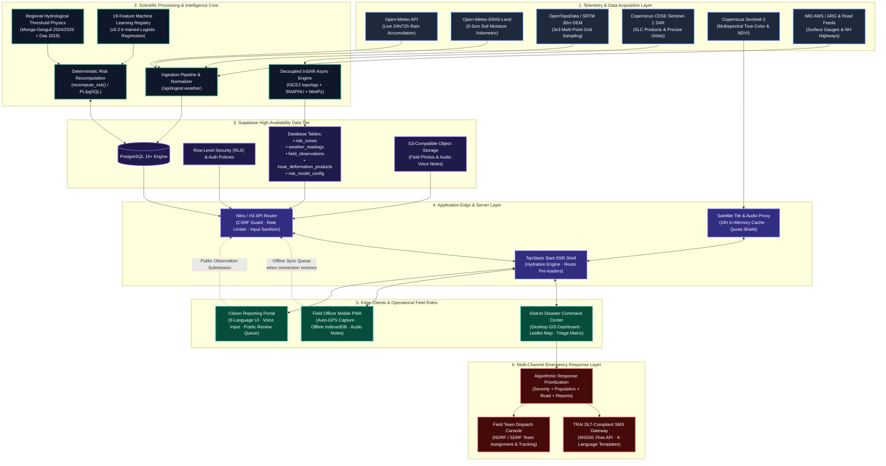
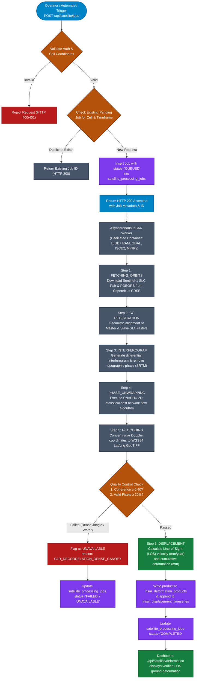
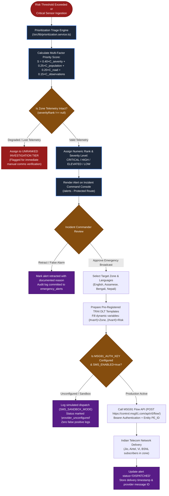
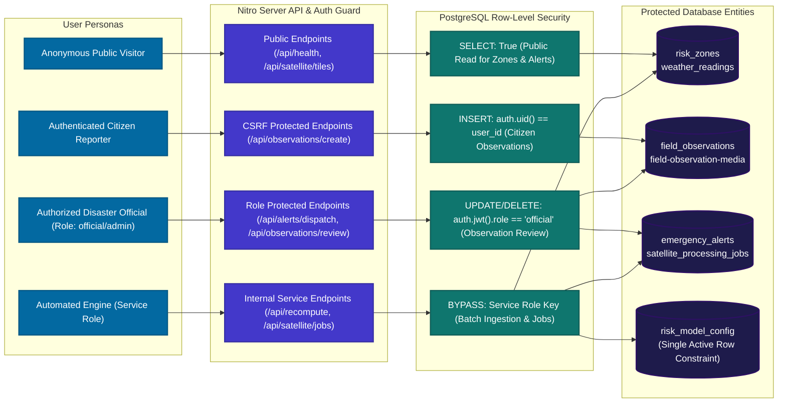

# LandAlert-Nexus: Comprehensive System Workflow & Architectural Diagrams

> **Note:** This document provides the complete, copy-pasteable diagrammatic workflow of LandAlert-Nexus.  
> You can copy these Mermaid code blocks into any Markdown viewer, Mermaid Live Editor ([mermaid.live](https://mermaid.live)), Notion, GitHub, or Mermaid-compatible documentation tool.

---

## 1. Complete Project Workflow (High-Level Overview)

A clear, end-to-end representation of how the entire LandAlert-Nexus platform operates from data ingestion to emergency action:

```mermaid
flowchart LR
    %% High-level styling
    classDef source fill:#1e3a8a,stroke:#3b82f6,stroke-width:2px,color:#fff;
    classDef engine fill:#065f46,stroke:#10b981,stroke-width:2px,color:#fff;
    classDef storage fill:#4c1d95,stroke:#8b5cf6,stroke-width:2px,color:#fff;
    classDef portal fill:#78350f,stroke:#f59e0b,stroke-width:2px,color:#fff;
    classDef response fill:#7f1d1d,stroke:#ef4444,stroke-width:2px,color:#fff;

    subgraph S1["1. Data Ingestion"]
        A1["🛰️ Satellite Radar & Optical<br/>(Sentinel-1 / Sentinel-2)"]:::source
        A2["🌧️ Weather & Soil Moisture<br/>(Open-Meteo & ERA5)"]:::source
        A3["📱 Ground Field Reports<br/>(Citizen & Officer PWA)"]:::source
    end

    subgraph S2["2. Risk & AI Engine"]
        B1["Radar InSAR Ground Velocity"]:::engine
        B2["Hydrological Rainfall Thresholds"]:::engine
        B3["Machine Learning Hazard Scoring"]:::engine
    end

    subgraph S3["3. Central Database"]
        C1[("Supabase PostgreSQL<br/>• Realtime Risk Status<br/>• Spatial Zones<br/>• Incident Reports")]:::storage
    end

    subgraph S4["4. Web Command Center"]
        D1["Interactive GIS Map"]:::portal
        D2["9 Regional Languages & Offline PWA"]:::portal
        D3["Officer Review & Verification Console"]:::portal
    end

    subgraph S5["5. Emergency Response"]
        E1["🚨 TRAI DLT Emergency SMS Alerts"]:::response
        E2["🚒 NDRF / SDRF Team Dispatch"]:::response
        E3["📢 Public Advisory & Evacuation Warning"]:::response
    end

    %% Data Flow
    A1 --> B1
    A2 --> B2
    B1 & B2 --> B3
    B3 --> C1
    A3 --> C1

    C1 <--> S4
    S4 --> S5
```



---

## 2. Detailed Architectural Component Flowchart



---

## 2. Telemetry Ingestion & Risk Scoring Workflow

```mermaid
sequenceDiagram
    autonumber
    actor Cron as pg_cron / External Trigger
    participant Ingest as /api/ingest-weather (API Router)
    participant OpenMeteo as Open-Meteo / ERA5-Land
    participant DB as Supabase (PostgreSQL)
    participant RiskProc as recompute_risk() (PL/pgSQL)
    participant ML as ML Risk Classifier (v0.2-lr)
    participant UI as Dashboard Clients (SSE / Poll)

    Cron->>Ingest: Trigger Scheduled Ingestion (POST /api/ingest-weather)
    Ingest->>OpenMeteo: Fetch 24h/72h rainfall & 0-3cm soil moisture for 15 NER zones
    OpenMeteo-->>Ingest: Return hourly precipitation + volumetric soil moisture (m³/m³)
    
    Ingest->>Ingest: Normalize soil moisture (0-100% using 0.40 m³/m³ field capacity)
    Ingest->>DB: Upsert into `weather_readings` (idempotent ON CONFLICT)
    
    Ingest->>RiskProc: Execute `SELECT recompute_risk();`
    
    activate RiskProc
    RiskProc->>DB: Query active `risk_model_config` (v0.2-lr-trained weights & thresholds)
    RiskProc->>DB: Compute 72-hr rainfall, 30-day antecedent rain, slope P90, soil moisture
    RiskProc->>RiskProc: Evaluate Regional Equations:
    Note over RiskProc: Sikkim: I = 43.26 × D^(-0.78) (Das et al. 2018)<br/>NER Regional: E = -11.10 + 0.62 × D (Monga & Ganguli 2024/2026)
    RiskProc->>ML: Extract 19 canonical features & compute hazard probability
    ML-->>RiskProc: Return calibrated hazard score [0.0 - 1.0]
    RiskProc->>RiskProc: Generate dynamic plain-language attribution (highest weighted factor)
    RiskProc->>DB: Update `risk_zones` (current_risk_level, risk_score, dominant_factor)
    RiskProc->>DB: Record historical row in `risk_evaluations`
    deactivate RiskProc

    RiskProc-->>Ingest: Return recomputed zone count & summary
    Ingest-->>Cron: HTTP 200 OK
    DB-->>UI: Realtime update triggers / Client queries new risk statuses
```

---

## 3. Satellite Radar (InSAR) Geodetic Processing Workflow



---

## 4. Resilient Offline-First Field Reporting & Voice Intelligence Workflow

```mermaid
flowchart TD
    classDef clientStep fill:#0f766e,stroke:#115e59,stroke-width:2px,color:#fff;
    classDef condition fill:#d97706,stroke:#b45309,stroke-width:2px,color:#fff;
    classDef offlineStep fill:#4338ca,stroke:#3730a3,stroke-width:2px,color:#fff;
    classDef syncStep fill:#059669,stroke:#047857,stroke-width:2px,color:#fff;

    Start(["Field Observer Opens PWA"]):::clientStep --> GeoInit["Background Geolocation Activation<br/>(navigator.geolocation.watchPosition)"]:::clientStep
    
    GeoInit --> GeoStore["Persist coordinates in SessionStorage & IndexedDB<br/>(Accuracy, Timestamp, Lat/Lng)"]:::clientStep
    
    GeoStore --> OpenReport["Observer Clicks 'Report Landslide'"]:::clientStep
    
    OpenReport --> AutoPopulate["Zero-Click Form Population:<br/>1. Lat & Lng set from GPS<br/>2. Reverse spatial match finds State, District & Zone ID<br/>3. Observation time auto-stamped"]:::clientStep
    
    AutoPopulate --> InputChoice{"Select Input Method"}:::condition
    
    %% Typing branch
    InputChoice -- Text Typing --> LangText["Type observation in any of 9 languages"]:::clientStep
    
    %% Voice branch
    InputChoice -- Voice Input --> MicClick["Click Microphone Button"]:::clientStep
    MicClick --> MediaRec["Start MediaRecorder (Audio Blob capture)"]:::clientStep
    
    MediaRec --> NetCheckSpeech{"Internet Available<br/>for Speech API?"}:::condition
    NetCheckSpeech -- Yes (Online) --> LiveSpeech["Web Speech Recognition API<br/>Real-time speech-to-text transcript"]:::clientStep
    LiveSpeech --> TransServ["Translate regional text to English<br/>via translation.service.ts"]:::clientStep
    
    NetCheckSpeech -- No (Offline) --> FallbackAudio["Store Audio Blob locally in IndexedDB<br/>Append '[🎙️ Voice note (Xs)]' to description"]:::offlineStep
    
    LangText & TransServ & FallbackAudio --> AttachMedia["Attach Ground Photos / Damage Video (Optional)"]:::clientStep
    
    AttachMedia --> SubmitClick["Observer Clicks 'Submit Observation'"]:::clientStep
    
    SubmitClick --> NetCheckSubmit{"Network Status?"}:::condition
    
    %% Online Submit
    NetCheckSubmit -- Online --> DirectPost["POST /api/observations/create<br/>Upload media to Supabase Bucket<br/>Insert record to field_observations"]:::syncStep
    DirectPost --> SuccessToast["Display Success Confirmation<br/>Record live on community board"]:::syncStep
    
    %% Offline Submit
    NetCheckSubmit -- Offline --> LocalQueue["Save to IndexedDB 'pending_observations'<br/>Save media Blob to 'offline_media_blobs'"]:::offlineStep
    LocalQueue --> OfflineBanner["Display 'Stored Offline' Badge<br/>PWA background sync listener registered"]:::offlineStep
    
    OfflineBanner --> WaitConn{"Device Reconnects<br/>to Cellular / Wi-Fi?"}:::condition
    WaitConn -- Network Detected --> SyncEngine["Background Sync Engine (useSyncQueue.ts):<br/>1. Dequeue pending records<br/>2. Upload binary blobs to Supabase Storage<br/>3. Send POST /api/observations/create<br/>4. Remove processed items from IndexedDB"]:::syncStep
    SyncEngine --> SuccessToast
```



---

## 5. Emergency Incident Triage, Decision Support & SMS Alert Dispatch Workflow



---

## 6. Full Data Security & Row-Level Security (RLS) Model



---

## How to View and Export These Diagrams

1. **Mermaid Live Editor**:
   - Go to [https://mermaid.live](https://mermaid.live).
   - Copy any of the code blocks above and paste them into the code panel to render, edit, or download high-resolution SVG/PNG files.
2. **VS Code / Cursor / IDE**:
   - Install the **Markdown Preview Mermaid Support** extension to view rendered diagrams inline.
3. **Notion / GitHub / GitLab**:
   - Paste the block directly inside code blocks formatted as ````mermaid ... ````.
